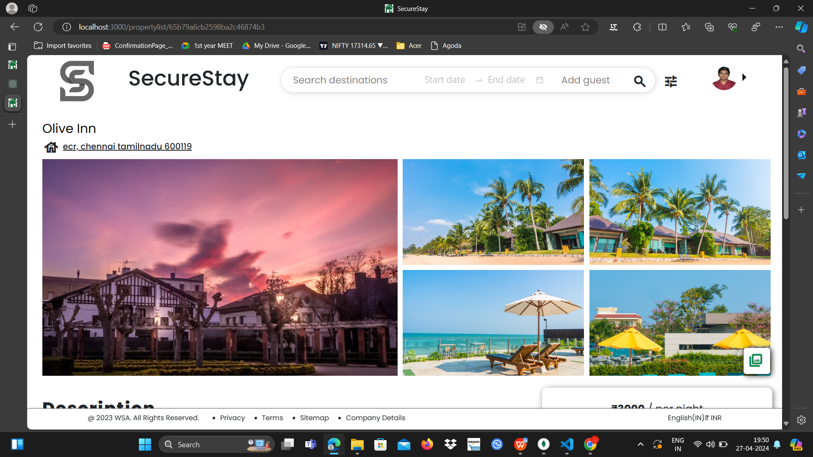
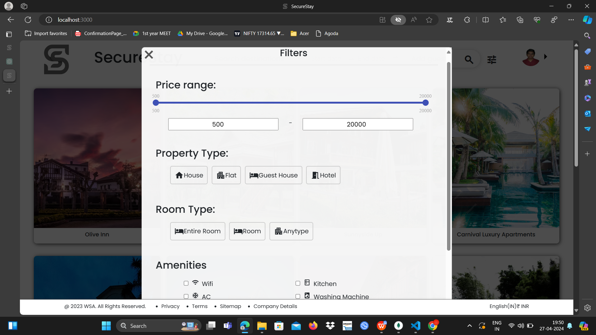

# SecureStay

SecureStay is a platform that enables users to find and book unique places to stay while traveling. It offers a diverse range of accommodation options, from cozy homes to luxurious villas. Hosts can list their properties to earn extra income, while guests can explore and book these properties for a personalized stay. The project is built using the MERN stack (MongoDB, Express.js, React, Node.js), and includes key features like user authentication, property search, booking, and payment integration.

## Table of Contents
- [Architecture](#architecture)
- [Features](#features)
- [Setup and Installation](#setup-and-installation)
- [Configuration](#configuration)
- [Usage](#usage)
- [Screenshots](#screenshots)

## Architecture
The SecureStay project uses the following technologies:
- **MongoDB**: NoSQL database for storing property and user data.
- **Express.js**: Server-side framework for creating API endpoints and handling server logic.
- **React**: Front-end library for creating a dynamic and responsive user interface.
- **Node.js**: Runtime environment for server-side JavaScript execution.
- **Redux**: State management for efficient data flow within the application.

The project follows a modular structure, implementing RESTful API principles to ensure scalability and maintainability.

## Features
- **User Authentication**: Sign-up, login, and profile management.
- **Search and Filters**: Find properties based on location, dates, pricing, and amenities.
- **View Listings**: Detailed information about each property, including photos, descriptions, and amenities.
- **Property Listings**: Hosts can list their accommodations, including images, descriptions, amenities, and pricing.
- **Booking System**: Users can select dates, view pricing, and confirm reservations with real-time updates.
- **User Profiles**: Manage bookings, update personal information, and track property listing activity.
- **Payment Integration**: Secure payment gateway for transactions.
- **Responsive Design**: Adapts to various devices for a consistent experience on desktop and mobile platforms.

## Setup and Installation
To set up the SecureStay project, ensure you have Node.js and MongoDB installed on your system. Follow these steps:

1. Clone the repository:
   git clone https://github.com/yourusername/SecureStay.git
   cd SecureStay
2. Install backend dependencies:
  cd backend
  npm install
3. Install frontend dependencies:
  cd ../frontend
  npm install
4.Start the MongoDB server (ensure MongoDB is running on your local system or a cloud-based service).
5.Start the backend server:
    cd ../backend  
    npm start
6.Start the frontend server:
  cd ../frontend
  npm start
7.Open your browser and navigate to http://localhost:3000.
## Configuration
To customize the project, update the configuration files as needed:

Backend Configuration: Edit backend/config/default.json to update database connection strings, authentication secrets, etc.
Frontend Configuration: Edit frontend/src/config.js to update API endpoints, payment gateway keys, etc.

## Usage
1.Sign up or log in to explore the platform.
2.Use the search functionality to find properties.
3.View property details, including descriptions, photos, and amenities.
4.Book a property by selecting the desired dates and following the payment process.
5.Manage your bookings and update profile information through the user profile section.

## Screenshots
Here are some screenshots showcasing SecureStay's features:

